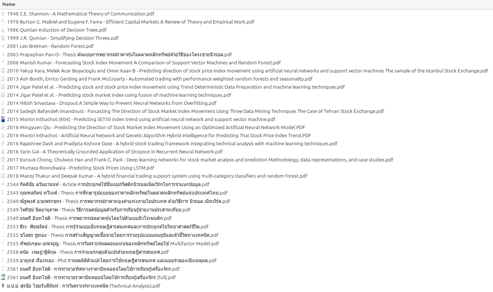

# just-pgvector-RAG-pipeline

A small, end-to-end **Retrieval-Augmented Generation** pipeline built on
**PostgreSQL + pgvector** — the database doing the vector work, not a bolted-on
vector store. Documents are chunked, embedded locally with a multilingual model
(**bge-m3**, strong on Thai *and* English), stored as `vector(1024)` in Postgres,
and retrieved by cosine distance through an HNSW index. Answers are generated by
**Claude** and grounded strictly in the retrieved passages.

> Built to show the full path a DBA actually owns:
> **raw documents → chunking → embeddings → pgvector index → retrieval tuning → LLM answer.**

## Architecture

```
.md/.txt/.pdf ─┐
               │  load (src/loaders.py) → chunk (src/chunk.py)
               ▼
        embed  (src/embed.py · bge-m3, local, multilingual)
           ▼
   ┌─────────────────────────────┐
   │ PostgreSQL + pgvector        │   documents(source, chunk_index,
   │   vector(1024), HNSW index   │             content, embedding)
   └─────────────────────────────┘
           ▲                 │  cosine  `<=>`
   embed query               ▼
   (src/retrieve.py) ──► top-k passages ──► Claude (src/ask.py) ──► grounded answer + citations
```

## Requirements

- PostgreSQL 14+ with the `pgvector` extension
- Python 3.10+
- An Anthropic API key (for the generation step only)

## Setup

```bash
# 1. Install PostgreSQL + pgvector  (Debian/Ubuntu; replace 16 with your version)
sudo apt-get update
sudo apt-get install -y postgresql postgresql-16-pgvector

# 2. Create the database, role, extension, and schema
bash scripts/setup_db.sh

# 3. Python environment
python3 -m venv .venv
source .venv/bin/activate
pip install -r requirements.txt

# 4. Configure
cp .env.example .env
#   then edit .env and set ANTHROPIC_API_KEY
```

## Usage

```bash
# Ingest a folder (chunk → embed → store). Handles .md / .txt / .pdf;
# scanned PDFs with no text layer are skipped with a warning.
python -m src.ingest literature_review     # point it at your own folder
python -m src.ingest data/paper.pdf a.txt  # or specific files

# Pure retrieval (no LLM) — inspect what the vector search returns
python -m src.retrieve "random forest stock prediction accuracy"

# Full RAG answer, grounded + cited (Thai or English)
python -m src.ask "งานวิจัยไหนใช้ random forest พยากรณ์ทิศทางดัชนีหุ้น?"
python -m src.ask "How does dropout prevent overfitting?"
```

Drop any `.md`/`.txt`/`.pdf` files into `data/` (or point `src.ingest` at any
folder) to index your own corpus. The pipeline is language-agnostic — Thai,
English, or mixed.

### Scanned PDFs (optional OCR)

PDFs that are scanned images have no text layer and are skipped on ingest. To
include them, OCR them first (Thai + English):

```bash
sudo apt-get install -y tesseract-ocr tesseract-ocr-tha
pip install pytesseract pillow
python scripts/ocr_pdf.py "literature_review/<scanned>.pdf"   # → ocr_text/*.txt
python -m src.ingest ocr_text
```

## Example

Real output, indexing **34 machine-learning / finance papers** (~15,500 chunks,
embedded on a single RTX 2070 — including 4 scanned Thai theses recovered via
OCR). The answers are grounded strictly in the retrieved passages and cite them.

The corpus is a personal literature review spanning ML foundations (Shannon,
Breiman, Quinlan, dropout, LSTM) and quantitative finance (efficient markets,
SVM/RF index forecasting, SET/SET50 and Bitcoin prediction theses) — titles
below. The PDFs themselves are copyrighted and not redistributed here.



**Cross-paper question (English):**

```text
$ python -m src.ask "Across these papers, how do random forest and SVM compare
  for predicting stock index direction? Cite which study found which result."

Based on the context passages, all citations refer to the same study by
Manish Kumar (2006), which compared SVM and Random Forest on the S&P CNX NIFTY.

  • SVM outperformed random forest and neural network by 1.04% and 5.51%
    respectively [4] — the highest accuracy of all methods tested.
  • The edge was attributed to SVM's structural risk minimization vs. the
    empirical risk minimization used by RF / neural nets [3].
  • Random forest still ranked second, ahead of neural net, discriminant
    analysis, and the logit model [4][2].

Sources:
  [1] 2006 Manish Kumar - Forecasting Stock Index Movement ... .pdf#11  (sim 0.793)
  [2] 2006 Manish Kumar - Forecasting Stock Index Movement ... .pdf#1   (sim 0.749)
  [3] 2006 Manish Kumar - Forecasting Stock Index Movement ... .pdf#66  (sim 0.740)
  ...
```

Note the honesty: the model states the evidence comes from a *single* paper
rather than inventing a cross-study comparison.

**Cross-paper question (Thai):** the same pipeline answers in Thai and pulls
from *five different* papers at once — a Thai bitcoin thesis, Dash & Dase, Kumar,
Inthachot (SET50), and Thakur & Kumar:

```text
$ python -m src.ask "การวิเคราะห์ทางเทคนิคมีแนวคิดพื้นฐานอะไรบ้าง และมีงานวิจัยไหน
  นำมารวมกับ machine learning เพื่อสร้างสัญญาณซื้อขาย?"

การวิเคราะห์ทางเทคนิคตั้งอยู่บนสมมติฐาน 3 ข้อ: ราคาสะท้อนข้อมูลทุกอย่าง,
ราคาเคลื่อนไหวตามแนวโน้ม, และพฤติกรรมนักลงทุนซ้ำรอยอดีต [1]. งานวิจัยที่นำมารวมกับ ML:
  • Dash & Dase (2016): CEFLANN + ELM กับ technical indicators 6 ตัว → Buy/Hold/Sell [2]
  • Inthachot (2015): trading rules ที่ optimize ด้วย Genetic Programming → Buy/Sell [4]
  • Thakur & Kumar (2018): multi-category classifiers + Random Forest [5]

Sources:
  [1] 2561 มนตรี อินทโชติ - การทำนายราคาบิทคอยน์ ... (full).pdf#3086        (sim 0.679)
  [2] 2016 Rajashree Dash and Pradipta Kishore Dase - A hybrid ... .pdf#9   (sim 0.646)
  ...
```

## MCP server — expose the corpus to any Claude client

`mcp_server.py` serves the corpus over the [Model Context Protocol](https://modelcontextprotocol.io),
so **any Claude client** (Claude Code in another project, Claude Desktop) can
retrieve from it as a tool — without knowing anything about pgvector or the
embedding model. It reuses the same retrieval path as the CLI.

Tools exposed:

| Tool | Purpose |
|------|---------|
| `search_corpus(query, top_k=5)` | semantic search → passages + source + score |
| `corpus_stats()` | indexed chunk/document counts and the document list |

Register once for **all** your Claude Code projects (user scope):

```bash
claude mcp add corpus-rag --scope user \
  -e HF_HUB_OFFLINE=1 -e TRANSFORMERS_OFFLINE=1 \
  -- /ABS/PATH/.venv/bin/python /ABS/PATH/mcp_server.py
```

For **Claude Desktop**, add to `claude_desktop_config.json`:

```json
{
  "mcpServers": {
    "corpus-rag": {
      "command": "/ABS/PATH/.venv/bin/python",
      "args": ["/ABS/PATH/mcp_server.py"]
    }
  }
}
```

The embedding model loads on the first `search_corpus` call, then stays warm for
the life of the server process.

## Layout

| Path | Role |
|------|------|
| `mcp_server.py` | MCP server exposing `search_corpus` / `corpus_stats` |
| `db/schema.sql` | `documents` table + HNSW vector index |
| `scripts/setup_db.sh` | one-time DB/role/extension bootstrap |
| `scripts/ocr_pdf.py` | optional OCR for scanned PDFs (Thai+English) |
| `src/config.py` | env-driven configuration |
| `src/loaders.py` | load .md/.txt/.pdf → text; detect scanned PDFs |
| `src/chunk.py` | language-agnostic chunking (works for Thai, no word spaces) |
| `src/embed.py` | local bge-m3 embeddings |
| `src/ingest.py` | chunk → embed → upsert |
| `src/retrieve.py` | cosine k-NN over pgvector |
| `src/ask.py` | retrieve → Claude → grounded answer |

## Notes

- **Why character-based chunking?** Thai text has no spaces between words, so
  token/whitespace splitting misbehaves. Fixed-size character windows with
  overlap are robust across both languages.
- **Why cosine + normalised embeddings?** bge-m3 vectors are L2-normalised, so
  cosine distance (`<=>`) is the natural metric; the HNSW index uses
  `vector_cosine_ops` to match.
- **Tuning knobs** live in `.env`: `CHUNK_SIZE`, `CHUNK_OVERLAP`, `TOP_K`,
  `EMBED_MODEL` (+ matching `EMBED_DIM` and `vector(N)` in the schema).
